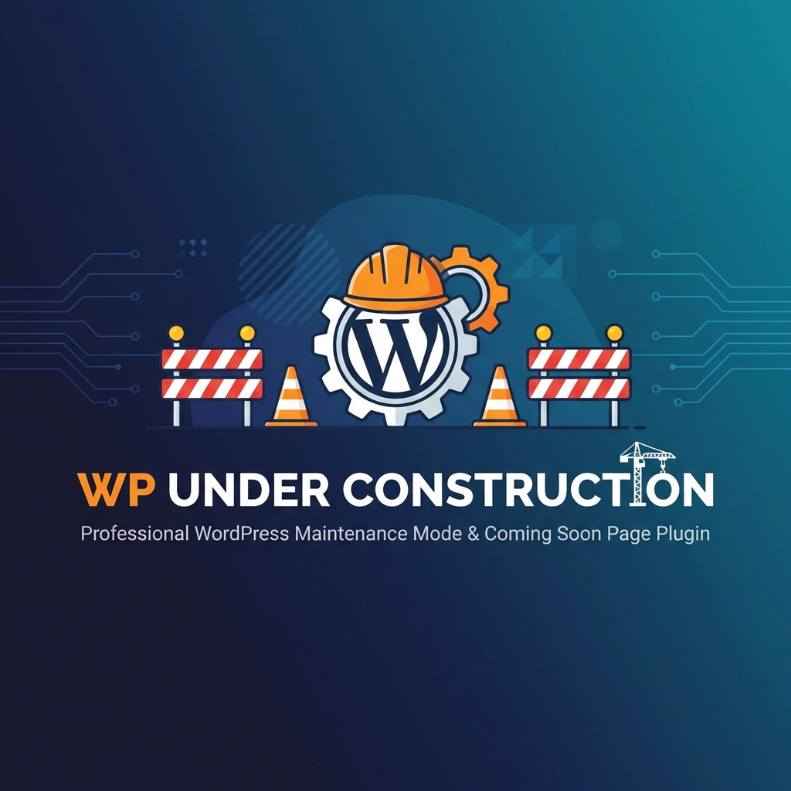

# WP Under Construction



[](https://github.com/sponsors/slider66)
[](https://wordpress.org/)
[](https://php.net/)
[](https://www.gnu.org/licenses/gpl-2.0.html)

Plugin ligero y profesional para WordPress que permite mostrar una **página de mantenimiento personalizada** mientras trabajas en tu sitio web. Los visitantes verán tu mensaje personalizado mientras que los administradores pueden acceder al sitio normalmente.

---

## ✨ Características

- 🎨 **HTML/CSS 100% personalizable** - Diseña tu propia página de mantenimiento
- 🔒 **Seguro** - Los administradores siempre tienen acceso al sitio
- ⚡ **Ultraligero** - Sin dependencias externas, carga instantánea
- 📱 **Responsive** - Plantilla por defecto adaptada a todos los dispositivos
- 🔍 **SEO Friendly** - Envía código HTTP 503 con cabecera Retry-After
- 👁️ **Vista previa** - Previsualiza tus cambios antes de activar
- 🌐 **Internacionalizado** - Preparado para traducción (text-domain incluido)

---

## 📦 Instalación

### Método 1: Subida manual (Recomendado)

1. **Descarga** el archivo `under-construction.php` desde este repositorio
2. **Accede** a tu panel de WordPress → `Plugins` → `Añadir nuevo` → `Subir plugin`
3. **Sube** el archivo y haz clic en `Instalar ahora`
4. **Activa** el plugin desde la lista de plugins

### Método 2: Vía FTP

1. **Descarga** el archivo `under-construction.php`
2. **Conéctate** a tu servidor vía FTP/SFTP
3. **Sube** el archivo a `/wp-content/plugins/wp-underconstruction/`
4. **Activa** el plugin desde `Plugins` en tu panel de WordPress

### Método 3: Clonando el repositorio

```bash
cd /ruta/a/tu/wordpress/wp-content/plugins/
git clone https://github.com/slider66/wp-underconstruction.git
```

---

## 🚀 Cómo usar

### Paso 1: Acceder a la configuración

1. Ve a tu panel de WordPress
2. Navega a **Ajustes** → **Under Construction**


### Paso 2: Personalizar tu página

El plugin incluye dos editores de código:

#### Editor HTML

Aquí escribes la estructura de tu página de mantenimiento. Puedes usar el marcador especial `{{CSS}}` donde quieras que se inyecten los estilos.

```html
<!DOCTYPE html>
<html lang="es">
  <head>
    <meta charset="UTF-8" />
    <meta name="viewport" content="width=device-width, initial-scale=1.0" />
    <title>Sitio en Mantenimiento</title>
    {{CSS}}
  </head>
  <body>
    <div class="maintenance-container">
      <h1>🚧 Estamos trabajando en mejoras</h1>
      <p>Nuestro sitio web está temporalmente en mantenimiento.</p>
      <p>Volveremos pronto con novedades.</p>
    </div>
  </body>
</html>
```

#### Editor CSS

Aquí defines los estilos de tu página. Se inyectarán automáticamente en `{{CSS}}`.

```css
* {
  margin: 0;
  padding: 0;
  box-sizing: border-box;
}

body {
  font-family:
    -apple-system, BlinkMacSystemFont, "Segoe UI", Roboto, sans-serif;
  background: linear-gradient(135deg, #1a1a2e 0%, #16213e 50%, #0f3460 100%);
  min-height: 100vh;
  display: flex;
  align-items: center;
  justify-content: center;
  color: #ffffff;
}

.maintenance-container {
  text-align: center;
  padding: 40px;
  max-width: 600px;
  background: rgba(255, 255, 255, 0.1);
  backdrop-filter: blur(10px);
  border-radius: 20px;
  border: 1px solid rgba(255, 255, 255, 0.2);
  box-shadow: 0 25px 50px rgba(0, 0, 0, 0.3);
}
```

### Paso 3: Vista previa

Antes de activar el modo mantenimiento, puedes previsualizar cómo se verá tu página haciendo clic en el botón **"👁️ Ver Vista Previa"**.

### Paso 4: Activar el modo mantenimiento

1. Activa el interruptor **"Activar Modo Mantenimiento"**
2. Haz clic en **"Guardar Cambios"**

> ⚠️ **Importante**: Los administradores logueados seguirán viendo el sitio normalmente. Usa una ventana de incógnito para verificar cómo lo ven los visitantes.

### Paso 5: Crear un backup de tu configuración

Es recomendable guardar un backup de tu configuración personalizada:

1. Ve a la sección **"💾 Backup / Restaurar Configuración"**
2. Haz clic en **"⬇️ Descargar Backup"**
3. Se descargará un archivo JSON con toda tu configuración

Para restaurar desde un backup:

1. Haz clic en **"Seleccionar archivo"** y elige tu archivo `.json`
2. Haz clic en **"⬆️ Importar Backup"**
3. Tu configuración se restaurará automáticamente

---

## 🔧 Funcionamiento técnico

### ¿Quién ve la página de mantenimiento?

| Tipo de usuario                  | ¿Ve la página de mantenimiento? |
| -------------------------------- | ------------------------------- |
| Visitantes anónimos              | ✅ Sí                           |
| Usuarios registrados (no admin)  | ✅ Sí                           |
| Administradores                  | ❌ No (ven el sitio normal)     |
| Peticiones AJAX/REST API         | ❌ No (funcionan normalmente)   |
| Página de login (`wp-login.php`) | ❌ No (siempre accesible)       |
| Cron de WordPress                | ❌ No (funciona normalmente)    |

### Cabeceras HTTP

Cuando el modo está activo, se envían las siguientes cabeceras:

- `HTTP 503 Service Unavailable` - Indica a los motores de búsqueda que es temporal
- `Retry-After: 3600` - Sugiere reintentar en 1 hora
- `Cache-Control: no-cache, no-store, must-revalidate` - Evita cacheo

### Indicador en la barra de admin

Cuando el modo está activo, verás un indicador rojo **"🚧 Modo Mantenimiento ACTIVO"** en la barra de administración para recordarte desactivarlo cuando termines.

---

## 🎨 Plantillas de ejemplo

### Plantilla minimalista

```html
<!DOCTYPE html>
<html lang="es">
  <head>
    <meta charset="UTF-8" />
    <meta name="viewport" content="width=device-width, initial-scale=1.0" />
    <title>Volvemos pronto</title>
    {{CSS}}
  </head>
  <body>
    <h1>Volvemos pronto</h1>
  </body>
</html>
```

```css
body {
  background: #000;
  color: #fff;
  height: 100vh;
  display: flex;
  align-items: center;
  justify-content: center;
  font-family: system-ui;
}
h1 {
  font-size: 3rem;
  font-weight: 200;
}
```

### Plantilla con cuenta regresiva

```html
<!DOCTYPE html>
<html lang="es">
  <head>
    <meta charset="UTF-8" />
    <meta name="viewport" content="width=device-width, initial-scale=1.0" />
    <title>Lanzamiento próximamente</title>
    {{CSS}}
  </head>
  <body>
    <div class="container">
      <h1>🚀 Algo increíble está en camino</h1>
      <div id="countdown">
        <div class="time-block">
          <span id="days">00</span><small>Días</small>
        </div>
        <div class="time-block">
          <span id="hours">00</span><small>Horas</small>
        </div>
        <div class="time-block">
          <span id="minutes">00</span><small>Minutos</small>
        </div>
        <div class="time-block">
          <span id="seconds">00</span><small>Segundos</small>
        </div>
      </div>
    </div>
    <script>
      // Cambia esta fecha a tu fecha de lanzamiento
      const launchDate = new Date("2026-03-01T00:00:00").getTime();

      setInterval(() => {
        const now = new Date().getTime();
        const diff = launchDate - now;

        document.getElementById("days").textContent = Math.floor(
          diff / (1000 * 60 * 60 * 24),
        );
        document.getElementById("hours").textContent = Math.floor(
          (diff % (1000 * 60 * 60 * 24)) / (1000 * 60 * 60),
        );
        document.getElementById("minutes").textContent = Math.floor(
          (diff % (1000 * 60 * 60)) / (1000 * 60),
        );
        document.getElementById("seconds").textContent = Math.floor(
          (diff % (1000 * 60)) / 1000,
        );
      }, 1000);
    </script>
  </body>
</html>
```

---

## ❓ Preguntas frecuentes

### ¿Por qué sigo viendo el sitio normal?

Estás logueado como administrador. Los administradores siempre ven el sitio normal para poder trabajar. Abre una ventana de incógnito para ver la página de mantenimiento.

### ¿Afecta al SEO de mi sitio?

No de forma negativa. El plugin envía un código HTTP 503 con cabecera `Retry-After`, que indica a los motores de búsqueda que el estado es **temporal** y que deben volver más tarde.

### ¿Puedo usar JavaScript en mi página?

¡Sí! Puedes incluir cualquier código JavaScript en tu HTML personalizado.

### ¿Es compatible con plugins de caché?

Sí, pero recuerda **limpiar la caché** después de activar o desactivar el modo mantenimiento para que los cambios se reflejen inmediatamente.

---

## 💖 Apoya este proyecto

¡Hola! Soy el desarrollador de wp-underconstruction. Dedico gran parte de mi tiempo libre a mantener este plugin gratuito, seguro y actualizado para que tu sitio web en WordPress funcione sin problemas.

Al apoyarme a través de GitHub Sponsors, me ayudas a cubrir los costes de desarrollo y a dedicar más horas a implementar nuevas funcionalidades. Tu soporte garantiza que este proyecto siga siendo gratuito y de código abierto para todos.

[](https://github.com/sponsors/slider66)

---

## 📄 Licencia

Este plugin está licenciado bajo la [GPL v2 o posterior](https://www.gnu.org/licenses/gpl-2.0.html).

---

## 🤝 Contribuir

Las contribuciones son bienvenidas. Por favor:

1. Haz un fork del repositorio
2. Crea una rama para tu feature (`git checkout -b feature/nueva-funcionalidad`)
3. Haz commit de tus cambios (`git commit -am 'Añade nueva funcionalidad'`)
4. Push a la rama (`git push origin feature/nueva-funcionalidad`)
5. Abre un Pull Request

---

**Hecho con ❤️ para la comunidad WordPress**
